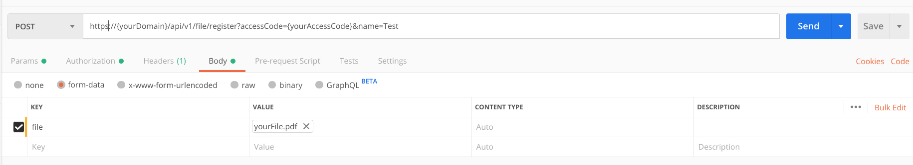

========
docker client API
========

The sproof API client is a docker container which encapsulates the ``js-sproof-client`` and can be accessed through regular API calls. Currently, this module supports the registration and the revocation of arbitrary files. The general structure of the API and the available operations are described below, followed by sample code in different programming languages.

.. _API-structure:

General API structure
=====================

The API is REST based and uses GET and POST requests. The general structure of the API is as follows:

.. code-block:: bash

    {method}: https://{yourDomain}/api/v{version}/{operation}?{parameters}&accessCode={yourAccessCode}

- ``method``: The HTTP method (GET or POST).
- ``yourDomain``: The domain on which you host the docker API client.
- ``version``: The API version (currently ``1``).
- ``operation``: The API operation that you want to call, e.g., ``commit`` (see below).
- ``parameters``: The parameters required for the operation (see below).
- ``yourAccessCode``: After the setup phase, the API can be accessed only with a valid access token. This token is generated locally. It must be provided in most calls to the API.

The return code of any API call is a HTTP status code. The status code indicates whether the call was successful or, in case it was not, why. The following status codes may be returned:

- ``200`` (OK): The call was successful.
- ``400`` (Bad Request): There are either parameters missing or the parameter values are invalid (e.g., out of range).
- ``401`` (Unauthorized): You do not have permission to perform this operation. Make sure that you provided your access code.
- ``402`` (Payment Required): You are trying to perform an operation for which you do not have sufficient funds. If you are not a premium user, choose a plan. If you are already a premium user, consider upgrading your plan. A plan can be chosen in your profile settings (https://app.sproof.io/#/choose-plan/).
- ``403`` (Forbidden): You do not have permission to perform this operation. Your access code is valid.
- ``404`` (Not Found): The ID, e.g., document or profile ID, that you specified does not exist.
- ``406`` (Not Acceptable): The Web server does not support the set of constraints you specified in the Accept headers of your request. Remove or loosen the constraints, i.e., send more liberal Accept headers.
- ``500`` (Internal Server Error): An error occured while processing the call. Please contact us (:doc:`../help`) if you receive this error so that we can investigate and fix it.
- ``501`` (Not Implemented): This feature is not implemented (yet). If you think that this feature should be implemented, please contact us (:doc:`../help`).

The following sections list the available API operations and their parameters. Sample code in different programming languages is available at the end (:ref:`example`).

.. _register-file:

Register file
=====================

This call registers a file in the sproof system and returns the hash as well as the ID of the registered document.

.. code-block:: bash

    POST: https://{yourDomain}/api/v1/file/register?public=false&name={name}&accessCode={yourAccessCode}

The body must contain a file embedded into a ``form-data`` field. The name of the document must be ``file``, as illustrated below:

----------
Parameters
----------

1. ``youAccessCode`` - Needed for authorization (see :ref:`API-structure`).
2. ``public`` - If the file should be publicly accessible, set ``public`` to ``true``. The default is ``false``.
3. ``name`` (optional) - A name for the file. This name may also be used as a tag.

-------
Returns
-------

  - ``hash`` - ``String``: The hash of the document.
  - ``location`` - ``String``: If the parameter ``public`` is set to true, it will return the IPFS location hash. IPFS references can be accessed via https://ipfs.io/ipfs/{locationHash}.
  - ``id`` - ``String``: The ID of the file, calculated from the issuer's address and the document hash.

------------------------------------------------------------------------------

Revoke file
=====================

This call revokes a previously registered file.

.. code-block:: bash

    POST: https://{yourDomain}/api/v1/file/revoke?accessCode={yourAccessCode}

The body must contain a file embedded into a ``form-data`` field. The name of the document must be ``file`` (see :ref:`register-file`).

----------
Parameters
----------

1. ``youAccessCode`` - Needed for authorization (see :ref:`API-structure`).

------------------------------------------------------------------------------

Verify file
=====================

This call checks whether the provided file has been registered and, if so, whether it and its issuer are valid.

.. code-block:: bash

    POST: https://{yourDomain}/api/v1/file/verify

The body must contain a file embedded into a ``form-data`` field. The name of the document must be ``file`` (see :ref:`register-file`).

-------
Returns
-------

The call returns ``List`` - a list of registration objects, or an error when no registration was found:

  - ``validation`` - ``Object``: Contains two boolean values which indicate whether the registration and the profile that performed it are valid. If both boolean values are ``true``, the registration and the profile are valid, i.e., they have not been revoked. If either value is ``false``, the registration or the profile has been revoked, respectively.
  - ``registration`` - ``Object``: The registration event where the file had been previously registered.
  - ``profile`` - ``Object``: Information about the issuer of the file.

------------------------------------------------------------------------------

Commit
=====================

Commits to the sproof platform are performed according the defined schedule. If an irregular commit is necessary, this call can be used.

.. code-block:: bash

    GET: https://{yourDomain}/api/v1/commit?accessCode={yourAccessCode}

----------
Parameters
----------

1. ``youAccessCode`` - Needed for authorization (see :ref:`API-structure`).

-------
Returns
-------
The call returns ``Object`` - an object about all information which is sent to the sproof platform to perform the commit. This includes all registrations, events and attached data.

------------------------------------------------------------------------------

State
=====================

This call returns the current state of the client API.

.. code-block:: bash

    GET: https://{yourDomain}/api/v1/state?accessCode={yourAccessCode}

----------
Parameters
----------

1. ``youAccessCode`` - Needed for authorization (see :ref:`API-structure`).

-------
Returns
-------
The call returns ``Object`` - an object about all information which is stored about the premium user. This includes information about the current transaction and events, including IDs.

------------------------------------------------------------------------------

.. _`example`:

API call example
=====================

The following is sample code to submit a (:ref:`register-file`) POST request to the API. The sample code is available in different, commonly used programming languages.

    .. tabs::

       .. tab:: PHP

        .. code-block:: bash

            <?php

                $document = '{YOUR PDF FILE}'

                //write file to filesystem
                tempFileName = tempnam(sys_get_temp_dir(), 'pdfDocForSproof');
                file_put_contents($tempFileName, $document);

                $ch = curl_init(
                    'https://{yourDomain}/api/v1/file/register?' . http_build_query([
                        'name' => 'Example Name',
                        'accessCode' => '{yourAccessCode}'
                    ])
                );

                curl_setopt($ch, CURLOPT_POST, 1);

                curl_setopt($curl, CURLOPT_POSTFIELDS, [
                    'file' => curl_file_create($tempFileName)
                ]);

                curl_setopt($ch, CURLOPT_RETURNTRANSFER, true);

                $server_response = curl_exec($ch);

                if (curl_errno($ch)) {
                  echo "Response: {$server_response}";
                 } else {
                   echo "Error: {$server_response}";
                  }

                curl_close ($ch);
                unlink($tempFileName);

            ?>

       .. tab:: C#

            .. code-block:: bash

                HttpClient client = new HttpClient(){
                    BaseAddress = new Uri("{yourDomain}"),
                    Timeout = TimeSpan.FromMilliseconds(5000)
                };;

                byte[] data = File.ReadAllBytes("{PATH TO FILE"});
                const string apiPath = "https://yourDomain/api/v1/file/register?name={NAME_OF_FILE}&accessCode={yourAccessCode}";
                var content = new MultipartFormDataContent();
                content.Add(new ByteArrayContent(data), "file", "file");

                try{
                    var response = await client.PostAsync(apiPath, content);
                    if (response.StatusCode != System.Net.HttpStatusCode.OK){
                        //handle Error
                    } else {
                        string jsonString = await response.Content.ReadAsStringAsync();
                        dynamic json = JsonConvert.DeserializeObject(jsonString);

                        if (json.error != null){
                            //handle Success
                        } else {
                            //handle Error
                        }
                    }
                }
                catch{
                    //handle error
                }

       .. tab:: Javascript

            .. code-block:: bash

                const FormData = require('form-data');
                const fetch = require('node-fetch');
                var fs = require('fs');

                let path = 'PATH TO FILE'
                let accessCode = 'yourAccessCode'

                var form = new FormData();
                var readStream = fs.createReadStream(path);

                form.append('file', readStream);
                fetch(`https://{yourDomain}/api/v1/file/register?accessCode=${accessCode}&name=test`, {
                  method: 'POST',
                  body: form
                })
                  .then(res => res.json())
                  .then(result => {
                    console.log('result', result);
                  })
                  .catch(error => {
                    console.error('error', error);
                });

       .. tab:: Java

           Coming soon. Feel free to edit the documentation on GitHub.
