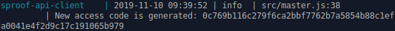

==============
Docker client setup
==============

The sproof API client is capable of registering, revoking and verifying data with an existing sproof account. It comes as a ready-to-use docker image that needs to be set up before its use. This document explains the prerequisites, the actual setup and the operation of the docker client.

Prerequisites
==============

The sproof API client is based on Doker Compose and requires a sproof account.

Docker Compose
--------------

Before you can set up the docker client, you need to install `Docker <https://docs.docker.com/>`_ and `Docker Compose <https://docs.docker.com/compose/>`_ on the machine where you want to install the API client. Please refer to the linked documentation for installation instructions for your operating system.

sproof account
--------------

In addition, a sproof account is required. Visit :doc:`../first/create-profile` for instructions on how to create an account. Note that testing is possible with a free account, while production-level operation requires a premium account.

Setup instructions
==============

1. Get `sproof-client-api`
--------------

The sproof API client is available at https://github.com/sproof/sproof-api-client. You can obtain the client either through ``git`` or through a regular download.

     .. tabs::

       .. tab:: git
       
        If you have ``git`` installed on your machine, you can use it to download the client:

        .. code-block:: bash

           git clone https://github.com/sproof/sproof-api-client.git
       
       .. tab:: Regular download
       
        `Download <https://github.com/sproof/sproof-api-client/archive/master.zip>`_ the source file archive and unpack the downloaded archive, e.g., with the following commands on Linux:
 
        .. code-block:: bash
        
           wget https://github.com/sproof/sproof-api-client/archive/master.zip
           unzip master.zip
           rm master.zip
        
        On Windows, the following PowerShell commands (require v5 or higher) do the same:

        .. code-block:: powershell
        
           wget https://github.com/sproof/sproof-api-client/archive/master.zip -OutFile master.zip
           Expand-Archive master.zip -DestinationPath .
           Remove-Item master.zip
           
After this step, you have a folder named ``sproof-api-client-master`` containing the source files of the docker client. This folder is the basis for all subsequent steps.

         
2. Set the docker client configuration
--------------

The docker client needs to be configured through a configuration file before being set up. Copy ``data/exampleConfig.js`` to ``data/config.js`` to obtain a sample configuration file which only requires setting your sproof code and (optionally) other parameters based on your needs. Please find a detailed description of the parameters in :doc:`../docker/docker-config`.

3. Set the verifier theme
--------------

The style of the Web interface for verifying documents exposed by the client needs to be specified through a configuation file. Copy ``data/exampleTheme.js`` to ``data/theme.js``. You can adjust colors and buttons styles, if you like. Please refer to the `Material UI theme documentation <https://material-ui.com/customization/theming/>`_ for details.

4. Set the translations
--------------

The strings used for button captions, error messages etc. need to be specified through a configuration file. For English and German, you will find ``exampleEn.js`` and ``exampleDe.js`` in the ``data`` folder. Copy them to ``en.js`` and ``de.js`` in the ``data`` folder and edit these files to adjust the translations, if you like.

Operation instructions
==============

Once the required configuration files are in place, the client can be built and run. As soon as it is running, you can access the docker client API through it.

Building the client
--------------

In order to build docker API client, run

``docker-compose up --build``

Note the ``--build`` parameter. It makes sure that the Web verifier is built with your custom theme.

After the build process completes successfully, an access code will be output both, on the console and in ``data/accessCode.json``. The output on the console looks like this:

The access code is a token which secures your API endpoint. It is is necessary for sending and processing most external API requests.

Running the client
---------------

After building the client, it will be started automatically. It will host an API endpoint as well as the verifier with your theme on port 6001 through a Web server.

Accessing the API
---------------

Once the docker client is running, you can access the client API through it. Note that, for most API calls, you need the access code that has been output during the build process. For a detailed documentation of the API endpoint as well as examples in multiple common programming languages, please see :doc:`../docker/docker-api`.
